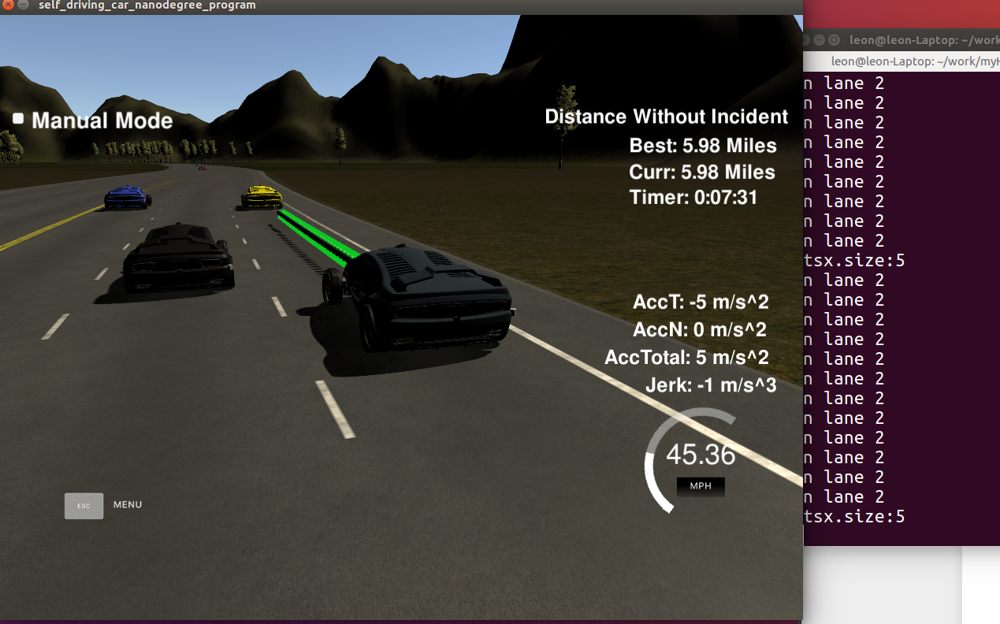

# Highway Driving

## 本项目为无人车创建一条可以适合高速行驶的预测路径

算法核心思路是，根据上一个路径剩余的最后两个坐标点，加上当前速度预测的远处30m/60m/90米取三个点，利用样条函数拟合出平滑的路径曲线；


需要注意的问题如下：

### 1.速度适中：

取参考速度从0开始，避免启动抖动问题

double ref_vel = 0.0; // mph

当前车距离大于安全距离时，ref_vel缓慢加速，直至到达最大限速

const double MAX_VEL = 49.5;；

当前车距离小于安全距离时，ref_vel将减速，或者寻找可能变道；

### 2.不能撞车：

直行时，保持与前车安全距离，车距小于安全距离时，将减速；

换道时，还需判断左右车道，后车的车距，必须具备安全车距；

### 3.合理切换车道：

当前车速度过慢，将寻找可能的变换车道，变换车道必须防止撞车；

### 4.加速度变化尽量平滑：

a.通过样条函数拟合出路径曲线;

b.根据车速变化取样本点，保持尽量小的加速度变化；

### 5.启动抖动问题

a. 速度从0开始，缓慢加速;

b. 所有样本点，沿汽车当前运行切线方向；


## 项目运行效果如下图



## 问题：

1.样条函数拟合曲线，假如加入代价函数，会不会取得更好Jerk值？


```python

```
